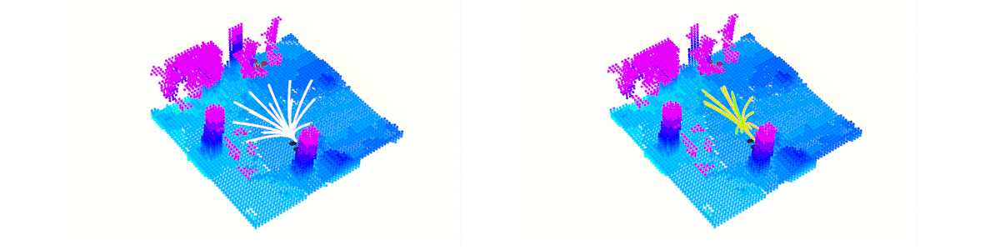
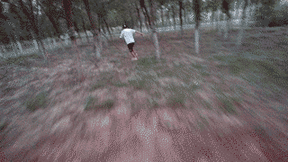
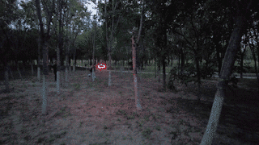
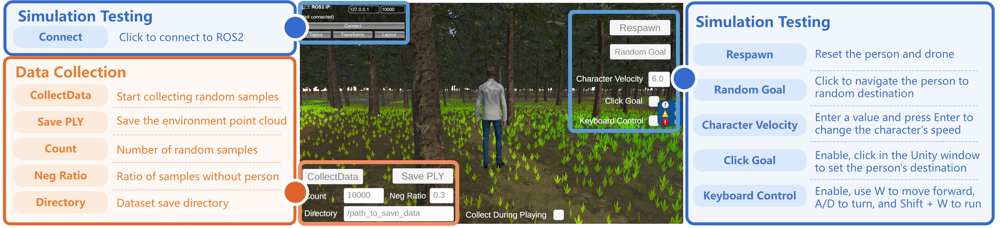
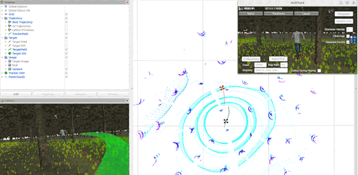

# You Only Plan Once

**Paper: [YOPOv2-Tracker: An End-to-End Agile Tracking and Navigation Framework](https://ieeexplore.ieee.org/abstract/document/11646866)**

Video of this paper: [](https://youtu.be/m7u1MYIuIn4)
[](https://www.bilibili.com/video/BV15M4m1d7j5)

Improvements to the navigation task described in the paper have been incorporated into the [YOPO](https://github.com/TJU-Aerial-Robotics/YOPO) repository.

**Results Visualization:** primitive anchors (exploring the target and feasible space) and predicted trajectories (color-coded by score).

<p align="center">
    
</p>

**Real-world Demostration:**

<table align="center">
    <tr>
        <td align="center"></td>
        <td align="center"></td>
    </tr>
    <tr>
        <td align="center">Tracker's Perspective</td>
        <td align="center">Evader's Perspective</td>
    </tr>
</table>


## Installation

The project was tested with Ubuntu 24.04 and Jetson Orin NX. We assume that you have already installed the necessary dependencies such as CUDA, ROS2, and Conda.

**1. Clone the Code and Download the Unity Simulator**
```
git clone --depth 1 git@github.com:TJU-Aerial-Robotics/YOPO-Tracker.git
```

Then, download our prebuilt Unity Simulator here.

**2. Create Virtual Environment**


```
conda create --name yopo python=3.12
conda activate yopo
cd YOPO
pip install -r requirements.txt
```
**3. Build Simulator** 

Build the controller and dynamics simulator
```
cd Controller
colcon build --symlink-install
```
Build the [ROS-TCP-Endpoint](https://github.com/Unity-Technologies/ROS-TCP-Endpoint) (used to connect to the Unity simulator)
```
cd UnityConnector
colcon build --symlink-install
```

## Unity Simulator Instructions

We built a forest simulation environment based on [YOPO-Sim](https://github.com/TJU-Aerial-Robotics/YOPO-Sim), where you can control the person and collect data. Additionally, we developed an FPS game simulator for human-vs-drone gameplay (to be added). See the figure below for usage instructions.

<p align="center">
    
</p>

## Test the Policy

You can test the policy using pre-trained weights we provide at `YOPO/saved/YOPO_1/epoch50.pth`. This model was trained at 6 m/s and can track a person moving at speeds of 0–6 m/s.

**1. Start the Controller and Dynamics Simulator** 

For detailed introduction about the controller, please refer to [Controller_Introduction](Controller/src/readme.md)
```
cd Controller
source install/setup.bash
ros2 launch so3_quadrotor_simulator simulator_attitude_control.launch.py
```
**2. Start the Unity Simulator**

Double-click `Tracker.x86_64` to run it. 
If needed, first make it executable with `chmod +x Tracker.x86_64`.  

Click `Connect` in the top-left corner. 
Then, launch ROS-TCP-Endpoint to bridge communication between Unity and ROS.

```
cd UnityConnector
source install/setup.bash
ros2 run ros_tcp_endpoint default_server_endpoint
```


**3. Start the YOPO Planner** 

```
cd YOPO
conda activate yopo
python test_yopo_ros.py --trial=1 --epoch=50
```

**4. Visualization**

```
cd YOPO
rviz2 -d yopo.rviz
```

You can test the policy in the following ways:

- Random Goal: Click to make the person navigate to random destinations.
- Click Goal: Enable, then click in the Unity window to set the person’s destination.
- Keyboard Control: Enable, then use `W` to move the person forward, `A/D` to turn, and `Shift + W` to run.
- ROS 2 Topic: Set the person’s navigation goal by publishing: `ros2 topic pub --once /character_0/nav_goal geometry_msgs/msg/Vector3 "{x: 0.0, y: 0.0, z: 0.0}"
`
- If the target is lost, click `Respawn` to reset the person, drone, and all programs (including planner and controller).

You should see the following:
<p align="center">
    
</p>

## Train the Policy
**1. Data Collection** 

For efficiency, we proactively collect dataset (RGB-D images, states, and map) by randomly resetting the drone's states (positions and orientations) and person's states (in front of the drone or out of view). You only need to collect the data once.

Click `CollectDate` and `Save PLY` in Unity to collect samples and save the environment map, respectively. 
The dataset directory structure is as follows:

```
YOPO-Tracker/
├── YOPO/
├── Controller/
├── ...
└── dataset/
    ├── scene-0/
    │   ├── depth/
    │   ├── rgb/
    │   ├── environment.ply
    │   └── label.csv
    ├── scene-1/
    ├── scene-2/
    └── ...
```


Optional: we also include the COCO dataset to improve generalization (details to be added).

**2. Train the Policy**


Replace `dataset_path` in the [traj_opt.yaml](YOPO/config/traj_opt.yaml) with the path to your dataset and then:

```
cd YOPO/
conda activate yopo
python train_yopo.py
```

You can visualize the training log by:

```
cd YOPO/saved
conda activate yopo
tensorboard --logdir=./
```

Besides, you can refer to [traj_opt.yaml](YOPO/config/traj_opt.yaml) for modifications of trajectory optimization (e.g. the speed and costs).


## Optional: TensorRT Deployment

The network uses a standard ResNet-18, making it easy to deploy with frameworks such as TensorRT and RKNN. We highly recommend using TensorRT for acceleration when flying in real world.

**1. Prepare**
```
conda activate yopo
pip install -U nvidia-tensorrt --index-url https://pypi.ngc.nvidia.com

git clone https://github.com/NVIDIA-AI-IOT/torch2trt
cd torch2trt
python setup.py install
```
**2. PyTorch Model to TensorRT**
```
cd YOPO
conda activate yopo
python yopo_trt_transfer.py --trial=1 --epoch=50
```
**3. TensorRT Inference**
```
cd YOPO
conda activate yopo
python test_yopo_ros.py --use_tensorrt=1
```
*Note: The above is the legacy setup I used on Ubuntu 20.04; untested on Ubuntu 24.04.*

## Finally
We are still working on improving and refactoring the code to improve the readability, reliability, and efficiency. For any technical issues, please feel free to contact me (lqzx1998@tju.edu.cn) 😀 We are very open and enjoy collaboration!

If you find this work useful or interesting, please kindly give us a star ⭐; If our repository supports your academic projects, please cite our paper. Thank you!

```
@article{YOPOv2,
  title={YOPOv2-Tracker: An End-to-End Agile Tracking and Navigation Framework},
  author={Lu, Junjie and Hui, Yulin and Zhang, Xuewei and Feng, Wencan and Shen, Hongming and Li, Zhiyu and Tian, Bailing},
  journal={IEEE Transactions on Robotics},
  year={2026},
  publisher={IEEE}
}
```
